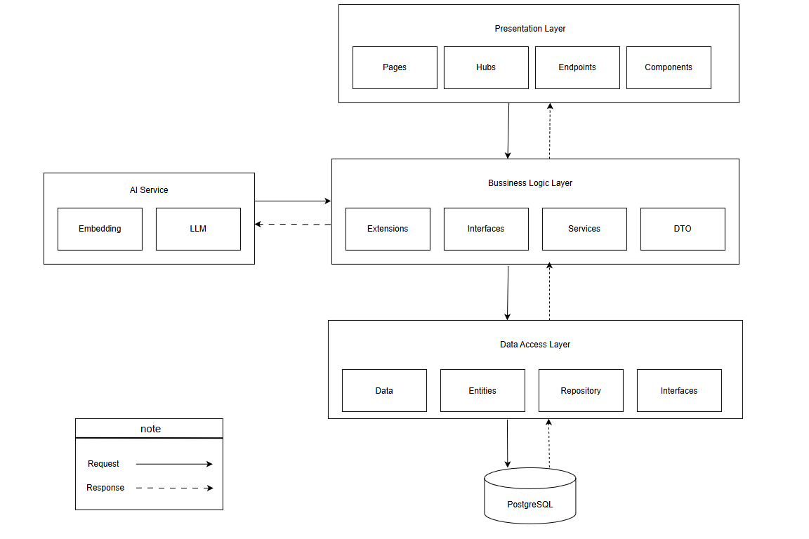

# Hệ Thống Quản Lý & Tìm Kiếm Tài Liệu Học Thuật Tích Hợp AI RAG (PRN222_RAZOR_RAG)

Hệ thống quản lý và tìm kiếm ngữ nghĩa tài liệu học thuật dành cho trường học. Ứng dụng mô hình **RAG (Retrieval-Augmented Generation)** kết hợp giữa tra cứu toàn văn và tìm kiếm ngữ nghĩa để cung cấp Chatbot thông minh trích xuất câu trả lời trực tiếp từ tài liệu đã được kiểm duyệt.

---

## 📖 Giới thiệu Chung

Hệ thống giúp sinh viên và giảng viên lưu trữ, quản lý tài liệu học thuật (sách, slide, đề thi...). Điểm nổi bật là người dùng có thể trò chuyện trực tiếp với tài liệu thông qua AI Assistant. Mọi câu trả lời của AI đều được đối chiếu (Grounded Generation) và có trích dẫn nguồn (Citations) chính xác từ tài liệu gốc.

---

## 🏗️ Kiến trúc Hệ thống

Dự án tuân thủ chặt chẽ **Kiến trúc 3 Lớp (3-Layer Architecture)**:
1. **GUI (Graphical User Interface):** Xây dựng bằng ASP.NET Core Razor Pages. Đảm nhiệm giao diện và không gọi trực tiếp Database.
2. **BLL (Business Logic Layer):** Chứa toàn bộ nghiệp vụ (Services), gọi API AI, xử lý background job (UploadJobs, EmailQueue).
3. **DAL (Data Access Layer):** Giao tiếp với PostgreSQL thông qua Entity Framework Core & Repository Pattern.


---

## 🛠️ Công nghệ Sử dụng

*   **Framework:** .NET 8 (ASP.NET Core Razor Pages)
*   **Database:** PostgreSQL + extension `pgvector` (vector dimension: 3072)
*   **ORM:** Entity Framework Core
*   **AI/LLM:** Google Gemini API (`gemini-2.5-flash` cho Chat và `gemini-embedding-2` cho Embeddings)
*   **Real-time:** SignalR (thông báo tiến độ xử lý file)
*   **Storage:** S3 Compatible Storage (MinIO/AWS S3)
*   **Tiện ích khác:** QuestPDF (xuất PDF), ClosedXML (đọc/ghi Excel)

---

## ✨ Tính năng Chính

*   **🔐 Quản lý Người dùng:** Đăng nhập nội bộ an toàn (PBKDF2), Admin tạo hàng loạt tài khoản qua Excel, ép buộc đổi mật khẩu lần đầu (Force Change Password).
*   **📚 Quản lý Tài liệu & Danh mục:** Quản lý môn học, học kỳ, loại tài liệu. Giảng viên phụ trách môn nào thì upload/quản lý tài liệu môn đó.
*   **⚙️ Xử lý Tài liệu Tự động (Background Job):** Upload file (PDF, DOCX, PPTX) -> Tự động trích xuất -> Chia chương -> Cắt chunk -> Nhúng vector (Embedding) hoàn toàn chạy ngầm.
*   **🔍 Tìm kiếm & So sánh:** Hybrid search kết hợp keyword và vector. Chức năng chọn nhiều tài liệu để AI so sánh điểm giống/khác nhau và xuất file PDF.
*   **🤖 Chatbot AI (RAG):** Trò chuyện với 1 hoặc nhiều tài liệu cùng lúc. AI stream câu trả lời theo thời gian thực (SSE) kèm theo box trích dẫn nguồn văn bản (Citations).

---

## 🚀 Hướng dẫn Sử dụng

### 1. Yêu cầu hệ thống
*   [.NET 8 SDK](https://dotnet.microsoft.com/en-us/download/dotnet/8.0)
*   PostgreSQL (đã cài đặt sẵn extension `pgvector`)
*   Key API của Google Gemini
*   Tài khoản SMTP (để gửi email) và hệ thống lưu trữ S3.

### 2. Cài đặt & Cấu hình
*   Clone source code về máy.
*   Mở tệp `appsettings.json` và cấu hình các thông số:
    *   `ConnectionStrings:DefaultConnection`: Chuỗi kết nối PostgreSQL.
    *   `Gemini:ApiKeys`: Mảng các API key của Google Gemini.
    *   `Smtp`, `S3`: Thông tin mail server và lưu trữ file.

### 3. Chạy ứng dụng
1.  Mở Terminal tại thư mục project.
2.  Chạy lệnh cập nhật database:
    ```bash
    dotnet ef database update
    ```
3.  Khởi động ứng dụng:
    ```bash
    dotnet run
    ```
4.  Truy cập hệ thống tại: `https://localhost:5001` (hoặc port được cấp).

### 4. Quy trình vận hành cơ bản
1.  **Admin:** Import danh sách User và Môn học (Subject) từ file Excel, sau đó gán quyền Giảng viên vào môn học.
2.  **Giảng viên:** Đăng nhập, tải tài liệu môn học lên. Chờ hệ thống báo "Xử lý thành công" (UploadJob).
3.  **Người dùng (Sinh viên/Giảng viên):** Vào mục Chat, chọn tài liệu và bắt đầu đặt câu hỏi cho AI.
