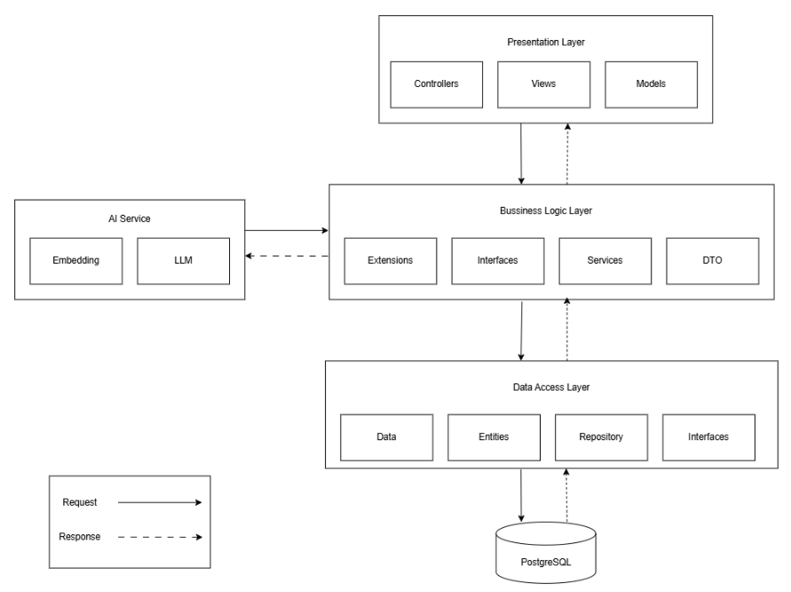

# Hệ Thống Quản Lý & Tìm Kiếm Tài Liệu Học Thuật Tích Hợp AI RAG (PRN222_RAZOR_RAG)

Hệ thống quản lý và tìm kiếm ngữ nghĩa tài liệu học thuật dành cho trường học, được xây dựng dựa trên mô hình **3-Layer Architecture** sử dụng ASP.NET Core 8 MVC kết hợp với cơ sở dữ liệu PostgreSQL (pgvector) và mô hình ngôn ngữ lớn (LLM) **Google Gemini API** cho hệ thống **RAG (Retrieval-Augmented Generation)**.

---

## 🗺️ Mục lục
1. [Giới thiệu Chung](#-giới-thiệu-chung)
2. [Kiến trúc Hệ thống](#-kiến-trúc-hệ-thống)
3. [Công nghệ Sử dụng](#-công-nghệ-sử-dụng)
4. [Các Tính năng Chính](#-các-tính-năng-chính)
5. [Cơ sở Dữ liệu (Database Schema)](#-cơ-sở-dữ-liệu-database-schema)
6. [Luồng Xử lý RAG & Tối ưu Hóa](#-luồng-xử-lý-rag--tối-ưu-hóa)
7. [Hướng dẫn Cài đặt & Cấu hình](#-hướng-dẫn-cài-đặt--cấu-hình)
8. [Hướng dẫn Sử dụng & Vận hành](#-hướng-dẫn-sử-dụng--vận-hành)

---

## 📖 Giới thiệu Chung

Hệ thống được thiết kế nhằm mục đích hỗ trợ học sinh/sinh viên và giảng viên lưu trữ, quản lý và tra cứu thông minh toàn bộ tài liệu học thuật (sách, giáo trình, slide bài giảng, đề thi...). 

Điểm nổi bật của hệ thống là việc ứng dụng kỹ thuật **RAG (Retrieval-Augmented Generation)** kết hợp giữa tìm kiếm toàn văn truyền thống (Full-Text Search) và tìm kiếm ngữ nghĩa vector (Semantic Search) để cung cấp một Chatbot thông minh giúp người dùng đặt câu hỏi và nhận câu trả lời chính xác, được đối chiếu trực tiếp và trích dẫn cụ thể (Tài liệu, Chương, Trang) từ nguồn học liệu đã được kiểm duyệt.

---

## 🏗️ Kiến trúc Hệ thống

Dự án áp dụng mô hình **3-Layer Architecture** đảm bảo sự phân tách độc lập giữa tầng logic nghiệp vụ và tầng truy cập dữ liệu/giao diện:



### 1. DAL (Data Access Layer)
*   **Nhiệm vụ**: Quản lý kết nối cơ sở dữ liệu thông qua Entity Framework Core (EF Core), định nghĩa các thực thể (Entities), cấu hình bảng và các chỉ mục (Indexes) đặc thù.
*   **Thành phần chính**:
    *   `DBContext`: Đăng ký các DbSet và cấu hình sử dụng tiện ích mở rộng vector của Postgres.
    *   `Repositories`: Triển khai các phương thức truy vấn thô và tối ưu hóa hiệu năng cơ sở dữ liệu (`AuthRepository`, `DocumentRepository`, `ChatRepository`, `UploadJobRepository`).

### 2. BLL (Business Logic Layer)
*   **Nhiệm vụ**: Xử lý logic nghiệp vụ của hệ thống, điều phối luồng xử lý tài liệu, phân đoạn chương, cắt chunk văn bản, giao tiếp với Gemini API để sinh Vector Embedding và phản hồi Chatbot.
*   **Thành phần chính**:
    *   `AuthService`: Xử lý đăng ký, đăng nhập hệ thống và phân quyền.
    *   `DocumentService`: Tạo metadata tài liệu, quản lý môn học, học kỳ.
    *   `UploadProcessingService` & `UploadJobBackgroundService`: Sử dụng cơ chế Hosted Service (`IHostedService`) chạy ngầm để tải tài liệu lên AWS S3, bóc tách text, cắt chunk và sinh vector mà không làm gián đoạn trải nghiệm người dùng trên trình duyệt (Asynchronous Processing).
    *   `ChatService` & `GeminiChatService`: Thực thi quy trình RAG (Nhận câu hỏi -> Embed -> Tìm vector tương đồng -> Xây dựng Prompt -> Gọi LLM -> Lưu lịch sử).

### 3. GUI (Presentation Layer)
*   **Nhiệm vụ**: Cung cấp giao diện tương tác với người dùng dưới dạng Razor Views và các REST APIs cho các tính năng thời gian thực (như Stream Chat).
*   **Thành phần chính**:
    *   `Controllers`: Điều phối yêu cầu và trả về Views hoặc DTOs (`AuthController`, `AdminController`, `DocumentsController`, `ChatController`, `ChatApiController`).
    *   `Views`: Giao diện bootstrap kết hợp tương tác Javascript cho việc hiển thị tài liệu, chat streaming, và các form quản trị của Admin.

---

## 💻 Công nghệ Sử dụng

*   **Framework**: .NET 8, ASP.NET Core MVC.
*   **Database**: PostgreSQL 15+, hỗ trợ phần mở rộng `pgvector` (cho tìm kiếm Vector), `uuid-ossp` (cho UUID tự tăng), và `pg_trgm` (cho tìm kiếm chuỗi).
*   **Object Storage**: Amazon S3 (AWS S3) dùng để lưu trữ file tài liệu gốc.
*   **AI Models**:
    *   `gemini-embedding-2` (gửi qua API Google Gemini) sinh vector 3072 chiều (được cấu hình qua `OutputDimensionality`).
    *   `gemini-2.5-flash` cho việc tạo phản hồi chat, phân mảnh chương (Chapter Segmentation) và tóm tắt tài liệu.
*   **ORM**: Entity Framework Core với nhà cung cấp Npgsql.
*   **Authentication**: Cookie Authentication cục bộ kết hợp đăng nhập nhanh qua Google OAuth.

---

## 🌟 Các Tính năng Chính

### 🛡️ 1. Phân quyền và Xác thực người dùng (Authentication & Authorization)
*   **Admin**: Quản lý người dùng, tạo tài khoản mới nhanh chóng qua Modal, phê duyệt/khóa tài khoản, xem báo cáo tài liệu xấu, phân công môn học quản lý cho Giảng viên.
*   **Lecturer (Giảng viên)**: Được phép đăng tải và cập nhật tài liệu học tập, slide bài giảng, đề thi. Chỉ được upload tài liệu cho các môn học được Admin phân công cụ thể.
*   **Student (Sinh viên)**: Tìm kiếm tài liệu, xem chi tiết tài liệu, đánh dấu (bookmark) tài liệu yêu thích, báo cáo tài liệu xấu và trò chuyện với Trợ lý AI.
*   *Lưu ý*: Cho phép đăng ký bằng bất kỳ tên miền email nào để đăng nhập thủ công, nhưng đối với hình thức đăng nhập nhanh bằng **Google Login**, hệ thống bắt buộc kiểm tra hậu tố `@fe.edu.vn` hoặc `@fpt.edu.vn` để đảm bảo định danh đúng vai trò thành viên của trường.

### 📂 2. Quản lý Tài liệu & Tiến trình Xử lý Ngầm (Document Pipeline)
*   **Hỗ trợ định dạng**: PDF, DOCX, PPTX.
*   **Luồng xử lý**: Giảng viên upload file -> Hệ thống lưu vào S3 và tạo 1 Job ngầm ở Database -> Background worker nhặt Job để tải về, bóc tách text dựa theo tọa độ Y để khôi phục định dạng đoạn văn -> Chia nhỏ tài liệu thành các Chunk tối ưu -> Gọi API Gemini để tính toán Vector Embedding của từng Chunk rồi lưu vào DB.

### 🤖 3. Trợ lý Học thuật AI (Chatbot RAG)
*   **Hỏi đáp thông minh**: Cho phép trò chuyện trực tiếp dựa trên nội dung của một tài liệu cụ thể hoặc trên toàn bộ kho tài liệu của môn học.
*   **Độ chính xác cao**: Hệ thống chỉ lấy thông tin trong phạm vi tài liệu (Grounded Generation). Nếu thông tin không có sẵn, AI sẽ từ chối trả lời thay vì bịa đặt thông tin.
*   **Trích dẫn nguồn cụ thể**: Cuối mỗi câu trả lời, AI tự động đánh dấu trích dẫn nguồn bao gồm: Tên tài liệu, tên chương, số trang cụ thể giúp người dùng đối chiếu nhanh chóng.
*   **Hỗ trợ Stream Chat**: Trả kết quả hiển thị dạng chữ chạy real-time giúp người dùng không phải chờ đợi lâu.

---

## ⚡ Luồng Xử lý RAG & Tối ưu Hóa

Hệ thống được tối ưu hóa sâu sắc ở khâu tiền xử lý dữ liệu và tích hợp LLM nhằm tránh các lỗi thường gặp trong môi trường Production:

1.  **Chống lỗi Rate Limit (429) của Gemini API**:
    *   Hệ thống chuyển đổi từ gọi đơn lẻ (`embedContent`) sang cơ chế gọi hàng loạt (`batchEmbedContents`). Đóng gói tối đa 10-60 chunks vào cùng một Request JSON để giảm số lần gọi API xuống tối thiểu.
    *   Tự động giãn cách thời gian gửi giữa các batch (`BatchDelaySeconds = 1` hoặc `2`) để giữ RPM ở mức an toàn cho tài khoản Gemini Free.
2.  **Khôi phục Định dạng Đoạn Văn khi phân tích PDF**:
    *   Sử dụng tọa độ Y của dòng chữ (`BoundingBox.Bottom`) để phân biệt hành động xuống dòng thông thường (`\n`) và chuyển sang đoạn văn mới (`\n\n`), giải quyết triệt để vấn đề mất Paragraph từ thư viện bóc tách PDF thô.
3.  **Semantic Chunking (Cắt Chunk theo ngữ nghĩa)**:
    *   Ưu tiên cắt theo đoạn văn (`\n\n`), sau đó đến câu (`.`, `?`, `!`), và cuối cùng mới cắt theo số từ để giữ nguyên ngữ cảnh tự nhiên của câu chữ.
    *   Cấu hình kích thước tối đa cho mỗi chunk lên **1100 từ** (`ChunkMaxWords = 1100`) đi kèm khoảng trùng lặp **100 từ** (`overlap = 100`) để đảm bảo thông tin giữa các chunk không bị đứt gãy mạch suy nghĩ.
4.  **Chapter Segmentation (Chia chương) bằng Map-Reduce**:
    *   Không gửi toàn bộ sách cùng lúc khiến LLM bị timeout hoặc quá tải. Tài liệu được chia thành các lô 40 chunk, sử dụng thuật toán quét lọc lấy các dòng ngắn (dưới 80 ký tự) làm tiêu đề tiềm năng gửi vào Prompt để định hướng AI.
    *   Áp dụng kỹ thuật **Context Passing**: Truyền thông tin chương cuối của lô trước sang lô sau để AI đánh số thứ tự chương nối tiếp nhau hoàn hảo mà không bị trùng lặp lại từ Chương 1.
    *   Bổ sung bộ lọc tự động vá lỗi JSON bị cắt cụt đầu/cuôi do quá giới hạn ký tự phản hồi của AI.
5.  **Tối ưu truy vấn Database (Tránh Cartesian Explosion)**:
    *   Áp dụng phương thức truy vấn chia tách `.AsSplitQuery()` của EF Core khi tải chi tiết tài liệu chứa đồng thời nhiều quan hệ 1-N lớn (`Files`, `Chunks`, `Chapters`), tăng tốc độ tải trang lên gấp 5 lần và giảm tải RAM máy chủ.
6.  **Tsvector Limit Safeguard**:
    *   Giới hạn cột `SearchText` cho tìm kiếm Full-Text Search ở mức 50,000 ký tự đầu tiên để ngăn chặn lỗi Postgres `54000: string is too long for tsvector` khi lưu trữ tài liệu kích thước lớn, trong khi cơ sở dữ liệu Vector vẫn lưu trữ trọn vẹn 100% dung lượng file gốc.

---

## 🛠️ Hướng dẫn Cài đặt & Cấu hình

### 📌 Yêu cầu hệ thống
*   Cài đặt **.NET SDK 8.0**.
*   Cài đặt **PostgreSQL 15+** kèm theo extension **pgvector**.
*   Tài khoản **AWS S3** (hoặc MinIO tương đương để test local).
*   **Google Gemini API Key** (tạo miễn phí tại Google AI Studio).

### 1. Chuẩn bị Cơ sở dữ liệu
Đăng nhập vào PostgreSQL và tạo cơ sở dữ liệu mới (ví dụ: `prn222_razor_rag`). Sau đó chạy file script SQL tại đường dẫn:
```bash
# Thực thi script tạo bảng, indexes và cài đặt các extensions cần thiết
Database/Database.sql
```

### 2. Cấu hình File `appsettings.json`
Mở file `GUI/appsettings.json` (hoặc `appsettings.Development.json`) và điền các thông số cấu hình:

```json
{
  "ConnectionStrings": {
    "DefaultConnection": "Host=localhost;Port=5432;Database=prn222_db;Username=;Password="
  },
  "Gemini": {
    "EmbeddingModel": "gemini-embedding-2",
    "ChatModel": "gemini-2.5-flash",
    "ApiKeys": [
      "YOUR_GEMINI_API_KEY_1",
      "YOUR_GEMINI_API_KEY_2"
    ]
  },
  "AwsS3": {
    "Region": "ap-southeast-1",
    "BucketName": "your-aws-bucket-name",
    "AccessKey": "YOUR_AWS_ACCESS_KEY",
    "SecretKey": "YOUR_AWS_SECRET_KEY"
  },
  "Authentication": {
    "Google": {
      "ClientId": "YOUR_GOOGLE_CLIENT_ID",
      "ClientSecret": "YOUR_GOOGLE_CLIENT_SECRET"
    }
  },
  "SmtpSettings": {
    "Server": "smtp.gmail.com",
    "Port": 587,
    "SenderName": "FPT RAG System",
    "SenderEmail": "your-email@fpt.edu.vn",
    "Password": "your-app-password"
  }
}
```

### 3. Khởi chạy Ứng dụng
Di chuyển vào thư mục dự án và chạy các câu lệnh:
```bash
# Khôi phục các gói thư viện
dotnet restore

# Build kiểm tra lỗi cú pháp
dotnet build

# Chạy ứng dụng
cd GUI
dotnet run
```
Truy cập vào địa chỉ mặc định `http://localhost:5000` hoặc `https://localhost:5001` (hoặc cấu hình IIS Express / Kestrel tương ứng).

---

## 🧭 Hướng dẫn Sử dụng & Vận hành

### 1. Tài khoản Quản trị mặc định (Admin Seed)
Khi chạy dự án lần đầu, hệ thống sẽ tự động tạo cơ sở dữ liệu và seed dữ liệu mẫu bao gồm tài khoản quản trị. 
*   **Đăng nhập**: Sử dụng chức năng Login bằng Email.
*   **Thông tin Admin mặc định**: (Kiểm tra trong phần seed của `DocumentService.cs` hoặc cấu hình seed mặc định của DB để lấy email/password).

### 2. Quy trình Cấp quyền tải tài liệu cho Giảng viên (Lecturer Workflow)
1.  **Tạo Tài Khoản**: Admin truy cập vào trang `/admin/users` -> Click nút **Tạo Tài Khoản** -> Điền thông tin giảng viên và chọn vai trò `Lecturer` -> Tạo thành công, tài khoản kích hoạt dùng ngay.
2.  **Phân Công Môn Học**: Tại dòng thông tin giảng viên vừa tạo, Admin click **Phân Công Môn Học** -> Check các môn học được giao cho giảng viên này quản lý -> Bấm **Cập nhật**.
3.  **Upload Học Liệu**: Giảng viên đăng nhập vào hệ thống -> Chọn menu **Tải Tài Liệu** -> Chọn môn học được phân công -> Chọn file (PDF/DOCX/PPTX) -> Bấm **Upload**. Tài liệu sẽ được chuyển vào hàng đợi xử lý ngầm và hiển thị trạng thái "Đang phân tích/Hoàn tất" trong vài phút.

### 3. Quy trình Trò chuyện cùng Tài liệu đối với Sinh viên (Student Workflow)
1.  Sinh viên đăng ký tài khoản thủ công hoặc Đăng nhập nhanh bằng tài khoản Google trường.
2.  Tìm kiếm tài liệu học tập theo từ khóa môn học hoặc tên tài liệu ở thanh tìm kiếm chính.
3.  Click vào chi tiết tài liệu học tập để đọc trực tiếp nội dung hoặc tóm tắt.
4.  Bấm vào nút **Chat với tài liệu này** -> Nhập câu hỏi -> Trợ lý AI phân tích và trả về câu trả lời kèm trích dẫn số trang chính xác giúp ôn tập hiệu quả.
