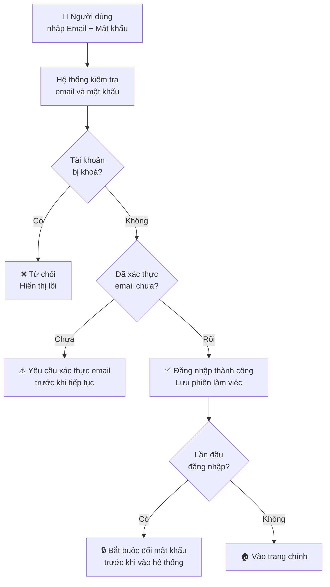
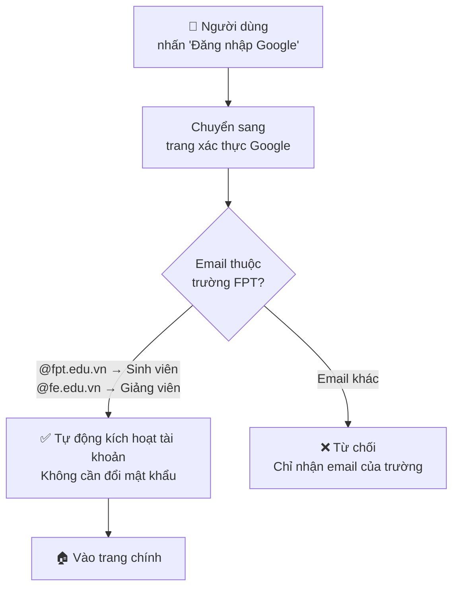
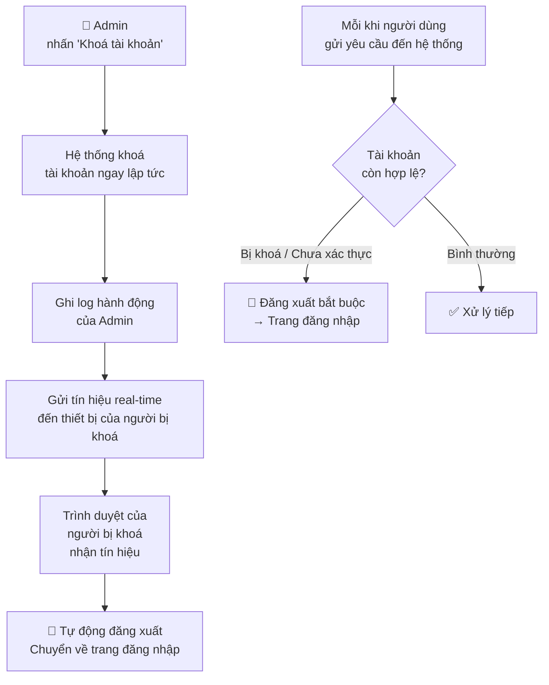
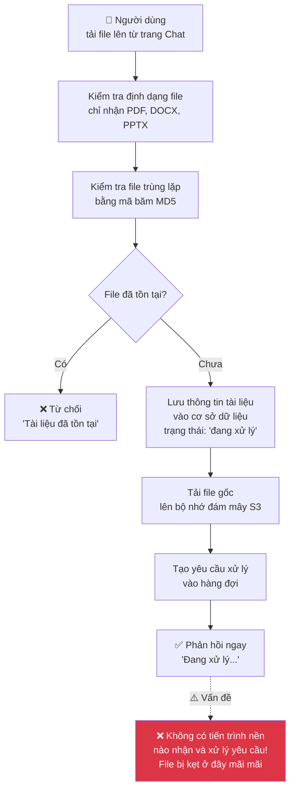
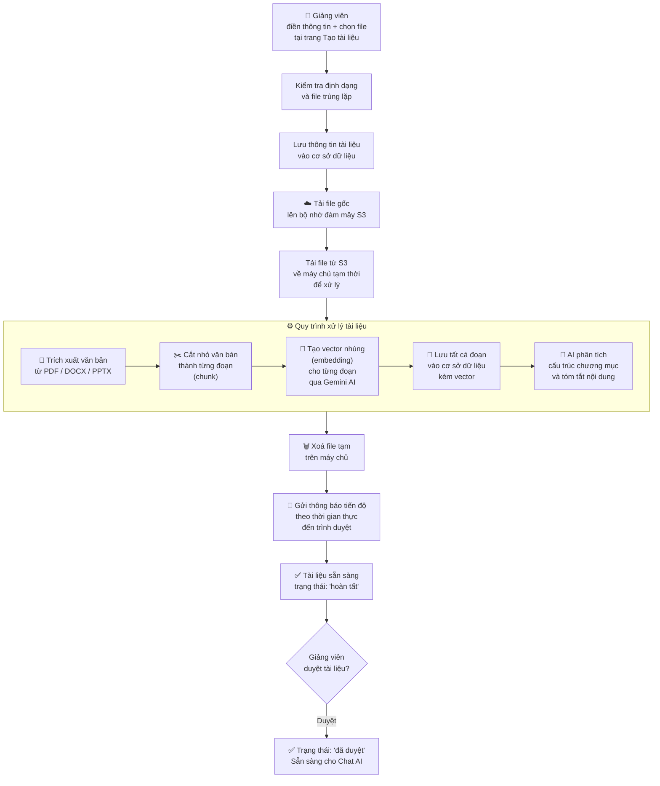
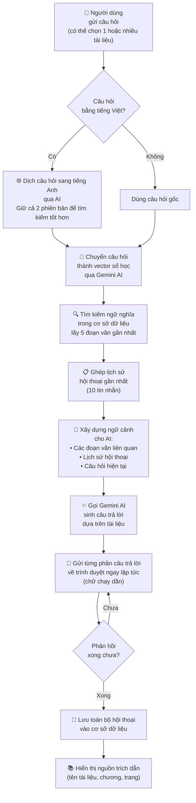
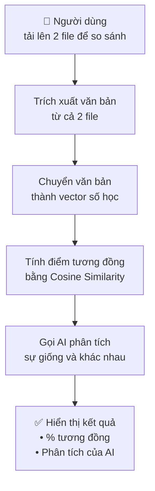
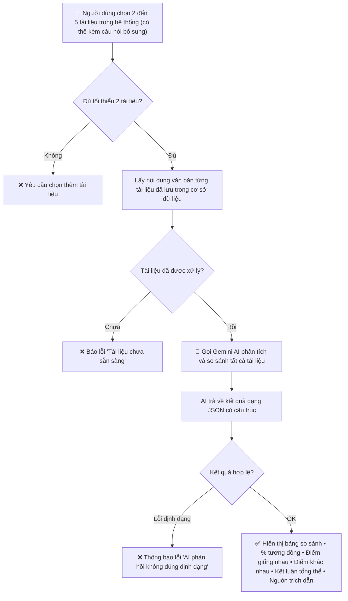
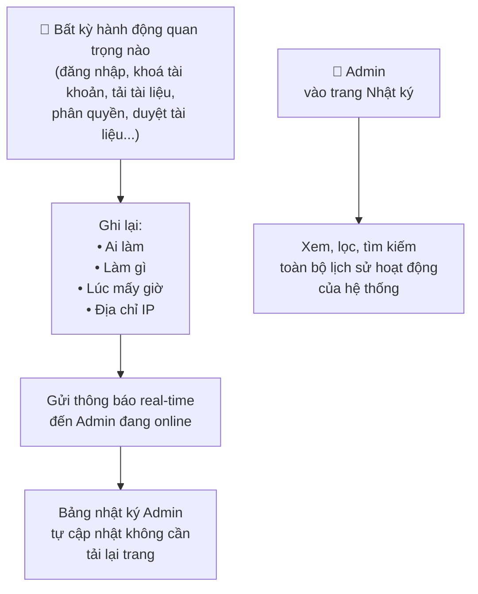

# Sơ Đồ Luồng Hệ Thống — FPT RAG
> Mô tả đơn giản, không có tên kỹ thuật.

---

## 1. 🔐 Đăng nhập

### 1A. Đăng nhập bằng Email & Mật khẩu

### 1B. Đăng nhập bằng Google

### 1C. Admin khoá tài khoản → Tự động đăng xuất

---

## 2. 📄 Tải lên & Xử lý tài liệu

### 2A. Tải nhanh từ trang Chat *(có vấn đề — xem ghi chú)*

> ⚠️ **Lỗi hiện tại:** File được tải lên S3 thành công nhưng **không bao giờ được tách đoạn và tạo vector embedding** vì thiếu tiến trình xử lý nền.

### 2B. Tải đầy đủ từ trang Giảng viên *(hoạt động đúng)*

---

## 3. 💬 Hỏi đáp với Trợ lý AI (Chat RAG)

### 3A. Luồng chính — Phản hồi trực tiếp (stream)

---

## 4. 📊 So sánh tài liệu

### 4A. So sánh file trực tiếp *(cách cũ)*

### 4B. So sánh tài liệu đã lưu trong hệ thống *(cách hiện tại)*

---

## 5. 📝 Nhật ký hoạt động (Audit Log)

---

## 6. ⚠️ Các vấn đề cần xử lý

| Mức độ | Vấn đề | Ảnh hưởng |
|--------|---------|-----------|
| 🔴 **Nghiêm trọng** | Tải file từ trang Chat xong nhưng **không bao giờ được xử lý** (tách đoạn, tạo vector) | Chat AI không dùng được file này |
| 🟡 **Trung bình** | Admin **không có giao diện** để chỉnh độ dài đoạn văn (chunk) — đang cố định trong code | Vi phạm yêu cầu FR2.3 + TC6 |
| 🟡 **Trung bình** | Hệ thống **không đếm số token** sử dụng thực tế khi tạo vector | Không có dữ liệu cho dashboard thống kê FR7.2 |
| 🟠 **Cao** | Chưa có trang **Thống kê hệ thống** cho Admin (FR7) | Thiếu chức năng mới |
| 🟠 **Cao** | Chưa có tính năng **So sánh mô hình AI** (FR8) | Thiếu chức năng mới |
| 🟠 **Cao** | Chưa có nút **Gửi lại mật khẩu tạm** cho Admin (FR1.8) | Thiếu chức năng |
| 🟡 **Trung bình** | Chưa có nút **Xuất kết quả so sánh ra PDF** (FR4.7) | Chức năng còn thiếu ở UI |
