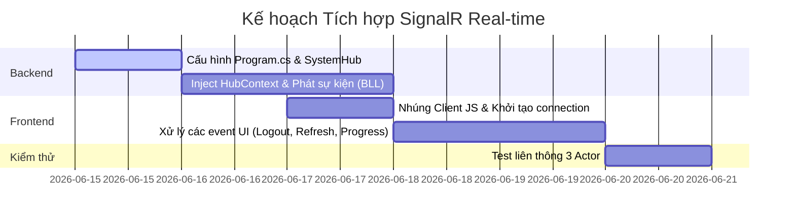

# Kế hoạch triển khai: Hệ thống Real-time SignalR cho mọi hoạt động CRUD (3 Actors)

Tài liệu này mô tả chi tiết quy trình thiết lập, kết nối và xử lý thời gian thực bằng **ASP.NET Core SignalR** cho toàn bộ các thao tác CRUD của 3 Actors (Admin, Giảng viên, Sinh viên) trong ứng dụng Razor Pages.

---

## 1. MỤC TIÊU & CHỨC NĂNG REAL-TIME
Thiết lập SignalR Hub để truyền thông điệp tức thời đến các Client khi có thay đổi dữ liệu:

| Actor thao tác | Hành động CRUD | Client bị ảnh hưởng | Hành vi Real-time mong muốn |
| :--- | :--- | :--- | :--- |
| **Admin** | Khóa/Xóa User (`is_blocked` hoặc delete) | **Lecturer / Student** bị tác động | Buộc đăng xuất ngay lập tức (**Force Logout**), xoá session cookie. |
| **Admin** | Đổi Role của User | **Lecturer / Student** bị tác động | Thông báo phân quyền thay đổi, reload lại quyền hạn hoặc buộc đăng nhập lại để nhận Claims mới. |
| **Admin** | CRUD môn học, học kỳ, loại tài liệu, ngôn ngữ | **Admin, Lecturer** | Danh sách cấu hình (Dropdowns, Tables) cập nhật tức thì không cần load lại trang. |
| **Admin** | Phê duyệt/Từ chối tài liệu | **Lecturer, Student (Owner)** | Trạng thái tài liệu chuyển đổi ngay lập tức trên màn hình cá nhân. |
| **Lecturer / Student** | Upload tài liệu | **Admin, Lecturer, Student** | Tiến trình phân tích, trích xuất text, và chia nhỏ vector hiển thị thanh phần trạng cập nhật thời gian thực (0% -> 100% -> Done). |
| **Lecturer / Student** | Thêm/Sửa/Xóa tài liệu cá nhân | **Admin, Lecturer, Student (Library)** | Thư viện tài liệu chung (`All.cshtml`) và trang quản lý tài liệu của Admin cập nhật thẻ/dòng tài liệu mới ngay lập tức. |

---

## 2. KIẾN TRÚC & PHƯƠNG ÁN TRIỂN KHAI

### Sơ đồ luồng SignalR
```
  [ Thao tác CRUD (POST/PUT/DELETE) ]
                  │
                  ▼
         [ Service Layer (BLL) ] ──(Thay đổi DB)──> [ Database ]
                  │
          (Gọi HubContext)
                  │
                  ▼
         [ SystemHub (GUI) ]
                  │
        (Gửi sự kiện Real-time)
                  │
                  ▼
   ┌──────────────┼──────────────┐
   ▼              ▼              ▼
[Admin UI]   [Lecturer UI]  [Student UI]
```

### Bước 1: Cấu hình phía Server (Backend ASP.NET Core)
1. **Đăng ký dịch vụ SignalR** trong `GUI/Program.cs`:
   ```csharp
   builder.Services.AddSignalR();
   ```
2. **Tạo `SystemHub.cs` tại thư mục `GUI/Hubs/SystemHub.cs`**:
   * Quản lý kết nối, nhóm người dùng theo **UserId** hoặc **Role** để gửi thông điệp chính xác:
     * Nhóm User: `Groups.AddToGroupAsync(Context.ConnectionId, $"User_{userId}");`
     * Nhóm Role: `Groups.AddToGroupAsync(Context.ConnectionId, $"Role_{roleName}");`
3. **Map Hub Route** trong `GUI/Program.cs`:
   ```csharp
   app.MapHub<SystemHub>("/systemHub");
   ```
4. **Tích hợp Phát Sự kiện Real-time ở các Service (BLL)**:
   * Inject `IHubContext<SystemHub>` vào các API endpoints/Service để broadcast khi lưu dữ liệu thành công.

### Bước 2: Tích hợp Client (Frontend Razor Pages JS)
1. **Nhúng Thư viện SignalR Client**:
   * Nhúng file SignalR qua CDN trong `Pages/Shared/_Layout.cshtml`:
     ```html
     <script src="https://cdnjs.cloudflare.com/ajax/libs/microsoft-signalr/8.0.7/signalr.min.js"></script>
     ```
2. **Khởi tạo và Quản lý kết nối (`site.js`)**:
   * Thiết lập kết nối tự động kết nối lại (`withAutomaticReconnect`).
   * Lắng nghe các sự kiện:
     * `ForceLogout`: Điều hướng trực tiếp sang trang Logout.
     * `RefreshUserList`, `RefreshMetadata`, `RefreshDocumentList`: Kích hoạt hàm gọi AJAX cập nhật UI tự động.
     * `UpdateUploadProgress(jobId, percent, message)`: Cập nhật UI thanh tiến trình upload.

---

## 3. LỘ TRÌNH THỰC HIỆN CHI TIẾT



### Phase 1: SignalR Setup & Core Hub (Server)
* Thêm SignalR vào `Program.cs`.
* Viết Hub chứa logic phân nhóm (Groups) theo ID người dùng và Vai trò.

### Phase 2: CRUD Admin & Actor Management Events
* Khi Admin cập nhật User (Khóa/Xóa/Đổi quyền): Gọi Hub phát tín hiệu `ForceLogout` tới User tương ứng.
* Khi Admin CRUD cấu hình (Metadata): Gọi Hub phát tín hiệu `RefreshMetadata`.

### Phase 3: Document Upload Progress & Document Updates
* Khi Job xử lý tài liệu chạy nền (Extract/Chunk/Embed): Cập nhật tiến độ `ProgressPercent` trực tiếp lên Client qua Hub.
* Khi tài liệu đổi trạng thái (Approve/Reject/Edit/Delete): Gửi tín hiệu reload danh sách tài liệu.
