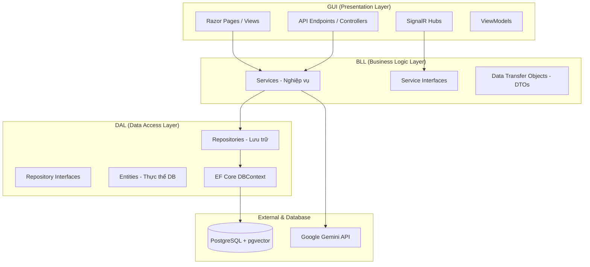

# Tài liệu Thiết kế Hệ thống (System Design) - Kiến trúc 3 Lớp (.NET 8)

Tài liệu này định nghĩa cấu trúc kiến trúc 3 lớp (3-Tier Architecture) được áp dụng trong dự án **PRN222_RAZOR_RAG**. Hệ thống được thiết kế để đảm bảo tính phân tách độc lập (Separation of Concerns), dễ bảo trì, mở rộng và kiểm thử (Unit Test).

---

## 1. SƠ ĐỒ KIẾN TRÚC TỔNG QUAN

Hệ thống tuân thủ nghiêm ngặt quy tắc phụ thuộc một chiều (Dependency Inversion): **GUI ➔ BLL ➔ DAL ➔ Database**.



---

## 2. CHI TIẾT CÁC LỚP (LAYERS)

### 2.1. Tầng Giao Diện - GUI (Presentation Layer)
* **Nhiệm vụ:** Tiếp nhận yêu cầu từ người dùng (HTTP request, WebSocket connection), hiển thị dữ liệu và trả về kết quả.
* **Công nghệ sử dụng:** ASP.NET Core Razor Pages, Bootstrap CSS, Javascript (SignalR Client).
* **Các thành phần chính:**
  * **Razor Pages (.cshtml & .cshtml.cs):** Render giao diện động phía server.
  * **SignalR Hubs (`SystemHub.cs`):** Quản lý kết nối thời gian thực bằng WebSockets.
  * **ViewModels:** Chứa cấu trúc dữ liệu tối ưu hóa riêng cho việc hiển thị hoặc validation trên Form (như `LoginViewModel`, `RegisterViewModel`).
* **Quy tắc:**
  * **TUYỆT ĐỐI KHÔNG** truy cập trực tiếp vào Database hoặc EF Core `DbContext`.
  * Chỉ giao tiếp thông qua các Interface của tầng BLL (ví dụ: `IAuthService`, `IDocumentService`).

---

### 2.2. Tầng Nghiệp Vụ - BLL (Business Logic Layer)
* **Nhiệm vụ:** Xử lý toàn bộ logic nghiệp vụ của hệ thống (Tính toán, kiểm tra quyền hạn, mã hóa, tương tác API AI, chunking tài liệu...).
* **Công nghệ sử dụng:** C# Class Libraries, Gemini API Client, AWS SDK (S3).
* **Các thành phần chính:**
  * **Interfaces (`IAuthService`, `IDocumentService`):** Định nghĩa chữ ký hàm nghiệp vụ để GUI gọi.
  * **Services (`AuthService`, `DocumentService`):** Thực thi logic nghiệp vụ cụ thể.
  * **DTOs (Data Transfer Objects):** Dùng để trao đổi dữ liệu giữa các tầng mà không làm rò rỉ thực thể Database (Entities) ra ngoài GUI.
* **Quy tắc:**
  * Tầng BLL **không phụ thuộc** vào tầng GUI.
  * Mọi tương tác xuống DB phải thông qua Interface của tầng DAL.

---

### 2.3. Tầng Dữ Liệu - DAL (Data Access Layer)
* **Nhiệm vụ:** Quản lý kết nối, truy vấn dữ liệu từ PostgreSQL và thực hiện các thao tác CRUD.
* **Công nghệ sử dụng:** Entity Framework Core (EF Core), pgvector (C# Client).
* **Các thành phần chính:**
  * **DBContext (`DBContext.cs`):** Quản lý Session kết nối cơ sở dữ liệu và cấu hình Fluent API.
  * **Entities:** Các class C# đại diện trực tiếp cho các bảng trong DB (như `User`, `Document`, `Subject`).
  * **Repositories (`AuthRepository`, `DocumentRepository`):** Đóng gói logic truy vấn SQL/EF Core để cung cấp API dữ liệu sạch cho BLL.
* **Quy tắc:**
  * Chỉ chứa logic truy vấn dữ liệu, **không chứa logic nghiệp vụ**.

---

## 3. LUỒNG DỮ LIỆU ĐIỂN HÌNH (DATA FLOW)

Dưới đây là ví dụ về luồng xử lý khi người dùng thực hiện Đăng nhập:

```mermaid
sequenceDiagram
    autonumber
    actor User as Người dùng
    participant GUI as GUI (Login.cshtml)
    participant BLL as BLL (AuthService)
    participant DAL as DAL (AuthRepository)
    database DB as PostgreSQL

    User->>GUI: Nhập Email/Password & submit form
    GUI->>BLL: Gọi ValidateCredentialsAsync(email, password)
    BLL->>DAL: Gọi GetUserByEmailWithRoleAsync(normalizedEmail)
    DAL->>DB: Thực thi SELECT * FROM users WHERE email = ...
    DB-->>DAL: Trả về bản ghi User
    DAL-->>BLL: Trả về đối tượng Entity User
    BLL->>BLL: Xác thực mật khẩu băm (PBKDF2)
    BLL-->>GUI: Trả về AuthUserDto (DTO)
    GUI->>GUI: Cấp Session Cookie (HttpContext.SignInAsync)
    GUI-->>User: Chuyển hướng về trang chủ (Index)
```

---

## 4. QUY TẮC THIẾT KẾ BẮT BUỘC (GUARDRAILS)

1. **Dependency Injection (DI):**
   * Mọi phụ thuộc giữa các lớp phải được giải quyết thông qua Constructor Injection sử dụng Service Container của ASP.NET Core.
2. **Không chia sẻ thực thể Database (No Entity Leakage):**
   * Tầng DAL trả về Entities. Tầng BLL nhận Entities, xử lý và bắt buộc phải Map sang **DTOs** trước khi trả về cho tầng GUI.
3. **Quản lý bất đồng bộ (Async/Await):**
   * Toàn bộ thao tác I/O (Database, API Call, S3 Storage) phải được viết dưới dạng Async (`Task`, `await`) và hỗ trợ `CancellationToken` để tối ưu tài nguyên máy chủ.
4. **Tích hợp SignalR Real-time:**
   * Tầng BLL định nghĩa `INotificationService`.
   * Tầng GUI triển khai SignalR (`SignalRNotificationService`) để đẩy thông báo thời gian thực xuống client. Nhờ đó, BLL vẫn độc lập hoàn toàn với SignalR.
