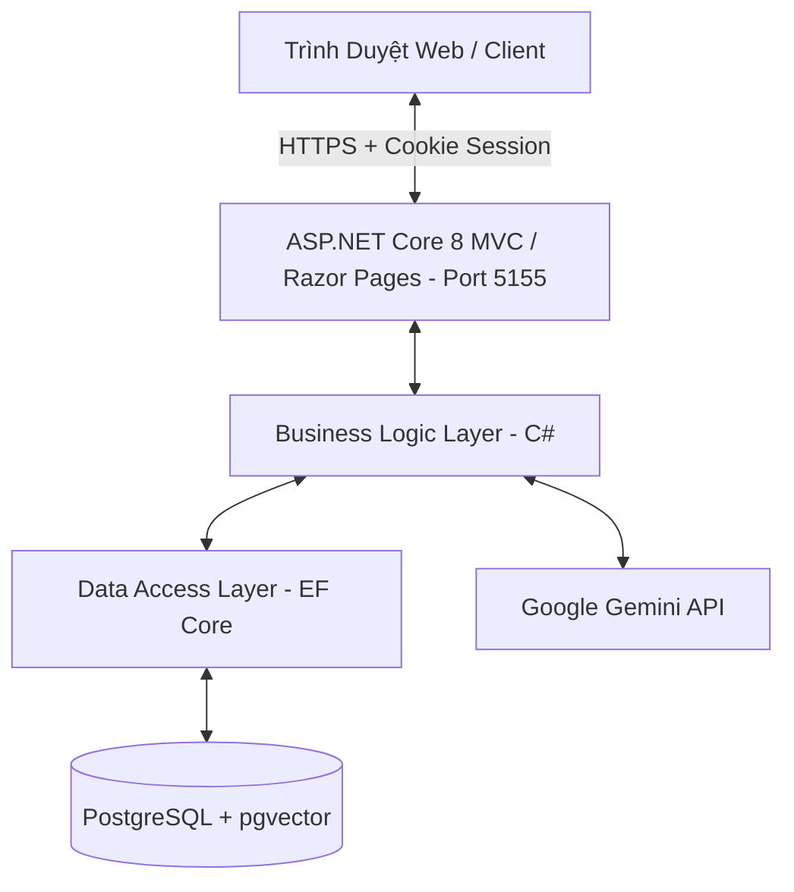

# Kế Hoạch Loại Bỏ Better Auth & Chuẩn Hóa Xác Thực NATIVE trong C# (PRN222)

## 📌 Tổng Quan
Kế hoạch này hướng dẫn chi tiết cách loại bỏ hoàn toàn dịch vụ phụ thuộc **Better Auth (Node.js/Hono)** chạy ở Port 5000 và thay thế bằng cơ chế **Cookie Authentication Native** được tích hợp sẵn của **ASP.NET Core 8**. 

Đồng thời, lược đồ cơ sở dữ liệu (ERD) sẽ được đơn giản hóa tối đa:
- Xóa bỏ các bảng `sessions`, `accounts`, và `verifications`.
- Hợp nhất mật khẩu trực tiếp vào cột `password_hash` của bảng `users`.
- Giảm số lượng tiến trình chạy từ **2** (C# + Node.js) xuống **1** duy nhất (C#).

---

## 🗺️ Sơ Đồ Kiến Trúc Mục Tiêu



---

## 📋 Chi Tiết Các Bước Thực Hiện

### Bước 1: Cập Nhật Lược Đồ Database & ERD (`Database/Database.sql`)
Loại bỏ 3 bảng của Better Auth và bổ sung cột `password_hash` vào bảng `users`.

#### 1. Sửa đổi định nghĩa bảng `public.users`:
```sql
CREATE TABLE public.users (
    id uuid DEFAULT public.uuid_generate_v4() NOT NULL,
    role_id smallint NOT NULL,
    full_name character varying(200) NOT NULL,
    email character varying(255) NOT NULL,
    password_hash character varying(255), -- Lưu trực tiếp chuỗi băm mật khẩu
    email_verified boolean DEFAULT false NOT NULL,
    username character varying(255),
    "displayUsername" character varying(255),
    avatar_url text,
    is_active boolean DEFAULT true NOT NULL,
    is_blocked boolean DEFAULT false NOT NULL,
    created_at timestamp with time zone DEFAULT now() NOT NULL,
    updated_at timestamp with time zone DEFAULT now() NOT NULL
);
```

#### 2. Xóa bỏ hoàn toàn định nghĩa các bảng sau khỏi tệp `.sql` và Database:
- `public.sessions`
- `public.accounts`
- `public.verifications`

#### 3. Xóa bỏ các index và khóa ngoại liên quan:
- Xóa `sessions_user_id_idx`, `accounts_user_id_idx`, `verifications_identifier_idx`.
- Xóa ràng buộc khóa ngoại `sessions_user_id_fkey` và `accounts_user_id_fkey`.

---

### Bước 2: Cập Nhật Tầng Dữ Liệu (DAL)

#### 1. Cập nhật `DAL/Data/DBContext.cs`
- Xóa `public virtual DbSet<Session> Sessions { get; set; }` (nếu có).
- Trong phương thức `OnModelCreating`:
  - Xóa cấu hình map Entity `Session`.
  - Thay đổi cấu hình thực thể `User`, bỏ qua dòng `entity.Ignore(e => e.PasswordHash);` và cấu hình lưu thuộc tính này vào DB:
    ```csharp
    entity.Property(e => e.PasswordHash)
        .HasMaxLength(255)
        .HasColumnName("password_hash");
    ```

#### 2. Xóa các File Entity không dùng:
- Xóa file `DAL/Entities/Session.cs` (và `Account.cs`/`Verification.cs` nếu có).

#### 3. Cập nhật Repository `IAuthRepository.cs` & `AuthRepository.cs`
- Xóa các phương thức liên quan đến Session và Account cũ:
  - `GetSessionWithUserAndRoleAsync`
  - `DeleteSessionAsync`
  - `CreateAccountAsync`
- Cập nhật phương thức `GetUserByEmailWithRoleAsync` đảm bảo EF Core sẽ tự động nạp thuộc tính `PasswordHash` trực tiếp từ bảng `users`.

---

### Bước 3: Cập Nhật Tầng Nghiệp Vụ (BLL)

#### 1. Cập nhật interface `IAuthService.cs`
- Xóa các chữ ký hàm:
  - `ValidateSessionTokenAsync`
  - `InvalidateSessionTokenAsync`

#### 2. Cấu trúc lại `BLL/Services/Auth/AuthService.cs`
- **Phương thức `RegisterAsync`**: Lưu trực tiếp mật khẩu đã băm vào thực thể `User` trước khi lưu vào DB.
  ```csharp
  public async Task<AuthUserDto> RegisterAsync(string fullName, string email, string password, short roleId, CancellationToken cancellationToken = default)
  {
      // ... Validate Email và Role ...
      var now = DateTime.UtcNow;
      var hashedPassword = HashPassword(password);
      
      var user = new User
      {
          Id = Guid.NewGuid(),
          FullName = fullName.Trim(),
          Email = normalizedEmail,
          PasswordHash = hashedPassword, // Lưu mật khẩu trực tiếp ở đây
          RoleId = roleId,
          IsActive = true,
          CreatedAt = now,
          UpdatedAt = now
      };

      var created = await _authRepository.AddUserAsync(user, cancellationToken);
      // LOẠI BỎ hoàn toàn việc gọi _authRepository.CreateAccountAsync
      return Map(created);
  }
  ```

- **Phương thức `ValidateCredentialsAsync`**: Đọc trực tiếp trường `PasswordHash` từ đối tượng `User` được trả về để xác thực.
  ```csharp
  public async Task<AuthUserDto?> ValidateCredentialsAsync(string email, string password, CancellationToken cancellationToken = default)
  {
      var normalizedEmail = email.Trim().ToLowerInvariant();
      var user = await _authRepository.GetUserByEmailWithRoleAsync(normalizedEmail, cancellationToken);

      if (user is null || user.PasswordHash is null) return null;

      if (!VerifyPassword(password, user.PasswordHash)) return null;

      // ... Kiểm tra IsBlocked, IsActive ...
      return Map(user);
  }
  ```

- **Xóa bỏ các hàm liên quan đến Session Token**:
  - `ValidateSessionTokenAsync`
  - `InvalidateSessionTokenAsync`

---

### Bước 4: Tích Hợp Xác Thực Native Trên Tầng Giao Diện (GUI)

#### 1. Cấu hình xác thực Cookie trong `GUI/Program.cs`
Duy trì Cookie Authentication sẵn có của ASP.NET Core nhưng loại bỏ HttpClient của Better Auth và cấu hình tự động chuyển hướng khi chưa đăng nhập.
```csharp
// XÓA BỎ đăng ký BetterAuth HttpClient cũ:
// builder.Services.AddHttpClient("BetterAuth", ...);

// Cấu hình Authentication mặc định
builder.Services.AddAuthentication(CookieAuthenticationDefaults.AuthenticationScheme)
    .AddCookie(options =>
    {
        options.LoginPath = "/Auth/Login";
        options.LogoutPath = "/Auth/Logout";
        options.AccessDeniedPath = "/Auth/Login";
        options.ExpireTimeSpan = TimeSpan.FromDays(7);
        options.SlidingExpiration = true;
    });
```

#### 2. Xóa các endpoint proxy và middleware cũ:
- Xóa tệp `GUI/BetterAuthHandler.cs`
- Xóa tệp `GUI/Endpoints/AuthProxyEndpoints.cs`
- Sửa `GUI/Program.cs`, xóa dòng `app.MapAuthProxyEndpoints();`

#### 3. Refactor trang Đăng Nhập (`GUI/Pages/Auth/Login.cshtml` & `Login.cshtml.cs`)
Thay vì dùng JS để gọi API và đồng bộ Token qua Callback, form đăng nhập sẽ POST trực tiếp dữ liệu lên Razor Page để xử lý bằng C#.

*   **`Login.cshtml`**: 
    - Sửa `<form id="login-form">` thành `<form method="post">`.
    - Sử dụng các thẻ input thông thường với thuộc tính `asp-for="Input.Email"` và `asp-for="Input.Password"`.
    - Xóa bỏ đoạn mã JavaScript `fetch('/api/auth/sign-in/email')` ở phần `@section Scripts`.

*   **`Login.cshtml.cs`**:
    ```csharp
    public async Task<IActionResult> OnPostAsync()
    {
        if (!ModelState.IsValid)
            return Page();

        try
        {
            // Xác thực email & password trực tiếp từ Database thông qua BLL
            var user = await _authService.ValidateCredentialsAsync(Input.Email, Input.Password);
            if (user == null)
            {
                ModelState.AddModelError(string.Empty, "Email hoặc mật khẩu không chính xác.");
                return Page();
            }

            // Tạo danh sách Claims định danh người dùng
            var claims = new List<Claim>
            {
                new(ClaimTypes.NameIdentifier, user.Id.ToString()),
                new(ClaimTypes.Email, user.Email),
                new(ClaimTypes.Name, user.FullName),
                new(ClaimTypes.Role, user.RoleName),
                new("role_id", user.RoleId.ToString())
            };

            var identity = new ClaimsIdentity(claims, CookieAuthenticationDefaults.AuthenticationScheme);
            var principal = new ClaimsPrincipal(identity);

            // Tiến hành đăng nhập và cấp phát Session Cookie
            await HttpContext.SignInAsync(
                CookieAuthenticationDefaults.AuthenticationScheme,
                principal,
                new AuthenticationProperties
                {
                    IsPersistent = true,
                    ExpiresUtc = DateTimeOffset.UtcNow.AddDays(7)
                });

            _logger.LogInformation("Người dùng {Email} đã đăng nhập thành công.", user.Email);
            return RedirectToPage("/Index");
        }
        catch (InvalidOperationException ex)
        {
            ModelState.AddModelError(string.Empty, ex.Message);
            return Page();
        }
    }
    ```

#### 4. Refactor trang Đăng Ký (`GUI/Pages/Auth/Register.cshtml` & Code-Behind)
Tương tự như Đăng Nhập, form đăng ký sẽ POST trực tiếp và gọi `_authService.RegisterAsync` từ C#. Sau khi đăng ký thành công, hệ thống tự động gọi `HttpContext.SignInAsync` để đăng nhập luôn cho người dùng.

#### 5. Sửa trang Đăng Xuất (`GUI/Pages/Auth/Logout.cshtml.cs`)
- Thực hiện đăng xuất Cookie trực tiếp từ .NET.
  ```csharp
  public async Task<IActionResult> OnGetAsync()
  {
      await HttpContext.SignOutAsync(CookieAuthenticationDefaults.AuthenticationScheme);
      return RedirectToPage("/Index");
  }
  ```

#### 6. Xóa các trang Callback dư thừa:
- Xóa hoàn toàn `GUI/Pages/Auth/Callback.cshtml` and `GUI/Pages/Auth/Callback.cshtml.cs` (Không còn dùng đến).

---

### Bước 5: Dọn Dẹp Mã Nguồn Dự Án

1. **Xóa thư mục Node.js**:
   - Xóa bỏ hoàn toàn thư mục `better-auth/` (nơi chứa `package.json`, `node_modules`, `tsconfig.json`, `auth.ts`, v.v.).
2. **Cập nhật Script khởi chạy**:
   - Sửa tệp `run-all.bat` (chỉ chạy ứng dụng C# GUI và bỏ qua việc chạy ứng dụng Node).
3. **Cập nhật Docker Compose**:
   - Sửa tệp `docker-compose.yml`, loại bỏ service định nghĩa container chạy `better-auth`.

---

## 🛡️ Đánh Giá Ưu Điểm Của Giải Pháp Mới
1. **Tinh gọn & Hiệu năng cao**: Loại bỏ 1 runtime (Node.js), giải phóng tài nguyên CPU/RAM cho máy chủ.
2. **Phát triển cục bộ mượt mà (DX)**: Lập trình viên chỉ cần chạy duy nhất 1 ứng dụng C# (nhấn F5). Không còn lỗi xung đột cổng `5000` hay port bị treo.
3. **Quản lý dữ liệu đơn giản**: Chỉ còn đúng 1 bảng `users` chứa thông tin đăng nhập, dễ dàng đồng bộ schema qua EF Core.
4. **Bảo mật tối đa**: Sử dụng cơ chế mã hóa Cookie phiên làm việc an toàn của Microsoft Data Protection, chống giả mạo cookie hoàn toàn tự động.
